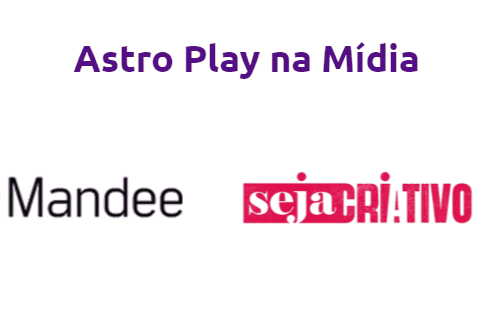

  <h2 align="center">Carrosel de Imagens da AstroCah</h2>

  

Este projeto consiste em um carrossel de imagens interativo criado com HTML e CSS. Os logotipos são exibidos em um carrossel que pausa a animação quando o mouse passa sobre ele. Ao clicar em um logotipo, a imagem correspondente é exibida na notícia, proporcionando uma experiência interativa aos usuários.     
    <a href="https://astroplay.app/"><strong>Visualizar o projeto »</strong></a>
     
     
  

  
<b>Versão Web

  
    
    
    
    
   
<b>Versão Mobile

  

 
 

## ☕ Como Usar
Você pode visualizar a página abrindo o arquivo `index.html` em um navegador da web. Certifique-se de que todos os arquivos CSS, imagens e fontes estejam na mesma pasta ou diretório.
 
 

## 📂 Estrutura do Projeto

- `index.html`: O arquivo principal que contém o conteúdo da página.
- `src/index/`: A pasta que contém os arquivos CSS para estilizar a página, resetar e a versão Mobile
- `src/images/`: A pasta que contém imagens usadas na página.
 

## 🚀 Tecnologias Utilizadas

* HTML
* CSS
 

## 👩🏽‍💻 Autora

Este projeto foi feito para um cliente Freelancer, onde o chefe da equipe me passou o que deveria ser feito.
 
 

## 📝 Licença

Este projeto está sob a licença  [Licença MIT](license.md). Você pode obter mais informações sobre a licença no arquivo LICENSE.
 
 
